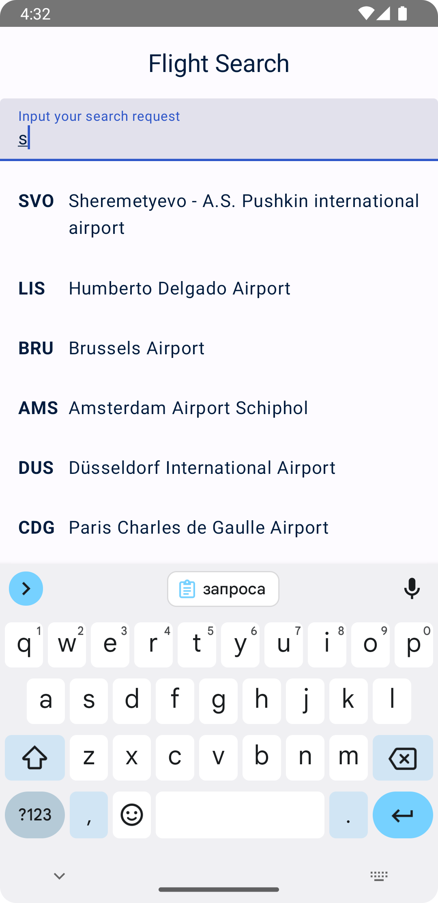
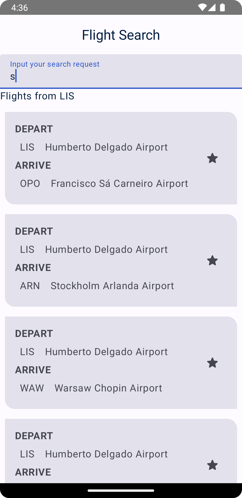
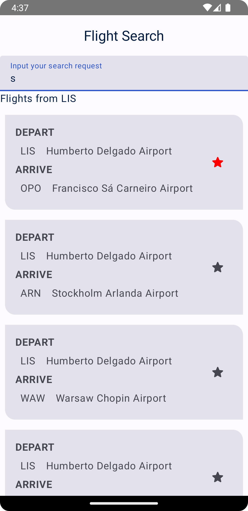

# Flight-Search
Flight Search App from developer.android.com

Данная программа выводит список доступных аэропортов при введении поискового запроса в текстовое поле.  
  
При нажатии на аэоропорт из списка, выводится новый список, с полетами, доступными из данного аэропорта.  
  
Каждый полет имеет возможность быть добавленным в список избранных полетов, путем нажатся на символ звезды.  
  
При наличии избранных полетов и при отсутствии поискового запроса в текстовом поле на галвном экране выводится список избранных полетов.  
  
Список аэропортов и избранных полетов хранятся в локальной базе данных. Доступ к базе данных реализован с помощью Room.  
Так же реализовано сохранение поискового запроса в памяти с использованием DataStore (При перезапуске приложения предыдущий запрос будет в поле поиска).